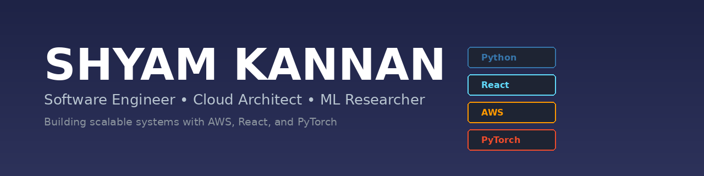

## 👋 About Me

Software Engineer building cloud-scale systems and applied machine learning | M.S. AI @ San Jose State University

---

## 🚀 What I'm Up To

- 🤖 Building **reinforcement learning and deep learning systems**
- ☁️ Designing **cloud-native backends** on AWS
- 🧠 Exploring **ML deployment, inference optimization, and MLOps**

👉 Portfolio: **https://shyam-kannan.vercel.app/**

---

## 💻 Tech Stack

**Languages:**     

**Frontend:**    

**Backend & APIs:**    

**Cloud & DevOps:**   

**Machine Learning:**    

**Databases:**   

---

## 🌐 Connect With Me

  <i>Open to software engineering, machine learning, and cloud-focused roles</i>

